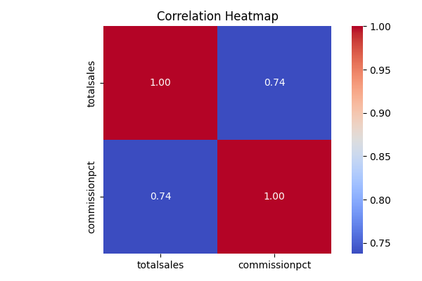
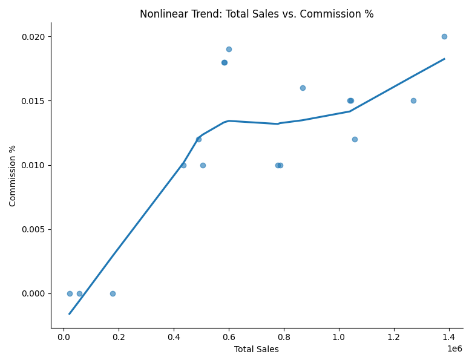

# AdventureWorks Sales & Product Analysis  

## 📌 Project Overview  
This project analyzes sales, product performance, and salesperson incentives using the **AdventureWorks** sample database. The workflow begins with **SQL** queries for data extraction, transformation, and aggregation, followed by **Python** for statistical analysis and visualization.  

The goal was to answer key business questions:  
- Which product categories/subcategories are performing best?  
- Who are the top-performing salespeople, and are commissions influencing performance?  
- How do sales differ across currencies and regions?  

---

## 🗂 Data Sources  
- **AdventureWorks Database** – Simulated retail transaction and product data  
- **SQL Exports** – Aggregated sales, commission, and currency data exported to CSV for Python analysis  

---

## 🛠 Tools & Technologies  
**SQL**: CTEs, JOINs, aggregation, CASE/COALESCE, filtering  
**Python**: Pandas, Matplotlib, Seaborn, SciPy  
**Statistical Methods**: Pearson & Spearman correlations  
**Visualization**: Heatmaps, scatterplots with trend lines  

---

## 📊 Analysis Steps  

### 1. **Product Popularity**  
- Tested correlation between average review ratings and sales.  
- Found insufficient review data → pivoted to sales-based analysis.  

### 2. **Sales Performance by Category**  
- Aggregated product quantities sold and list prices by category and subcategory.  
- Identified top-performing product groups.  

### 3. **Top Salespeople**  
- Calculated 2014 sales from raw order data for accuracy validation.  
- Ranked salespeople by total revenue generated.  

### 4. **Commission Impact Study**  
- Linked total sales to commission percentages.  
- Tested for statistical correlation between commission rate and sales performance.  

### 5. **Currency Adjustments**  
- Grouped sales by currency code.  
- Accounted for USD and foreign currency sales for fair comparisons.  

### 6. **Python Correlation & Visualization**  
- Loaded exported SQL results into Pandas.  
- Calculated **Pearson** (linear) and **Spearman** (non-linear) correlations.  
- Created a **correlation heatmap** and **non-linear trend scatterplot** to visualize relationships.  

---

## 📈 Key Findings  
- Product reviews were too sparse for a reliable popularity measure.  
- Certain product categories dominated sales in both quantity and revenue.  
- Top salespeople rankings from the database required validation through raw transaction aggregation.  
- Weak-to-moderate correlation between commission percentage and total sales suggests commissions may not be the primary performance driver.  
- Sales distribution varied significantly across currencies, impacting regional comparisons.  

---

## 📷 Visualizations  

**Correlation Heatmap**  
  

**Non-linear Trend Scatterplot**  
  

---
